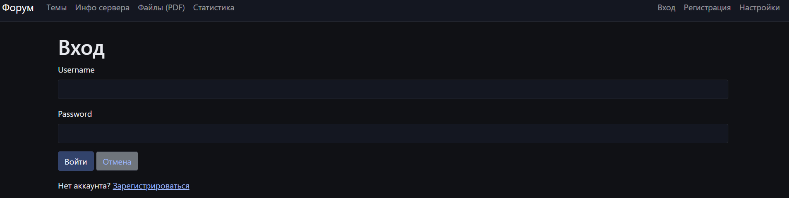
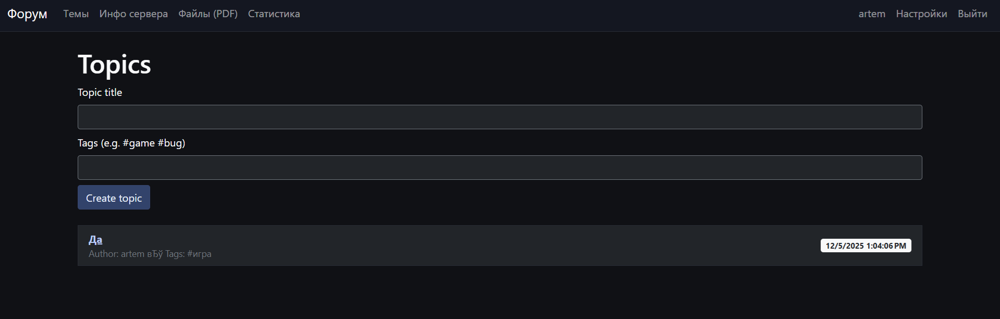
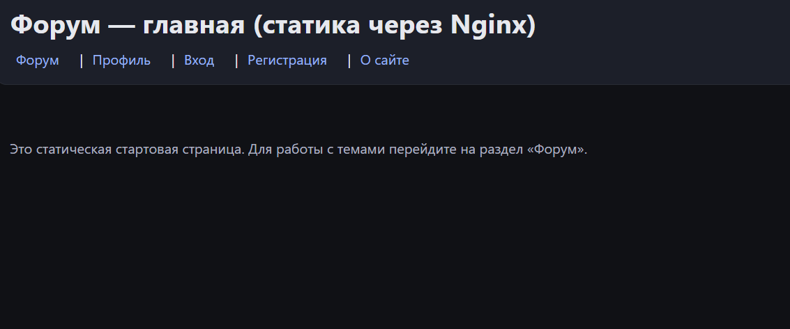

# GameForum

Современный учебный проект форума на ASP.NET Core Razor Pages с MySQL, Redis и Docker. Проект демонстрирует аутентификацию на куках, работу с кэшем/сессиями через Redis (включая хранение ключей Data Protection), генерацию статистики с графиками и базовые CRUD-функции форума.

## Возможности
- Аутентификация/авторизация на куках (cookie-based)
- Профиль пользователя, перенаполнение кук после изменения профиля
- Темы и сообщения (EF Core + MySQL)
- Генерация статистики и графиков (ScottPlot + ImageSharp) с водяным знаком
- Сессии ASP.NET Core в Redis + хранение ключей Data Protection в Redis
- Локализация (ru-RU / en-US)
- Docker Compose окружение: Nginx (опционально), приложение, MySQL, Redis

## Технологии
- ASP.NET Core 8 (Razor Pages)
- Entity Framework Core + Pomelo.MySql
- StackExchange.Redis + IDistributedCache + ASP.NET Data Protection в Redis
- ScottPlot, SixLabors.ImageSharp/Fonts/Drawing
- Docker / Docker Compose

## Быстрый старт (Docker)
Требуется установленный Docker Desktop.

1) Запуск
```bash
# из корня репозитория
docker compose up -d --build
```
Приложение поднимется на http://localhost:80 (через Nginx) или напрямую на 8080 внутри контейнера.

2) Первичная инициализация
- Приложение создаст базу и таблицы автоматически (EnsureCreated).
- Будет добавлен администратор:
  - Логин: admin
  - Пароль: admin123

3) Остановка
```bash
docker compose down
```

## Локальный запуск без Docker
Требуется .NET 8 SDK и локально поднятые MySQL + Redis.

1) Настройте подключение в `GameForum/GameForum/appsettings.json`:
```json
{
  "ConnectionStrings": {
    "DefaultConnection": "Server=db;Database=testdb;Uid=root;Pwd=pass;"
  },
  "Redis": {
    "Configuration": "redis:6379,abortConnect=false",
    "InstanceName": "gameforum"
  }
}
```
Замените `Server` и `redis` на ваши хосты.

2) Запуск
```bash
# из папки GameForum/GameForum
dotnet run
```
Откройте http://localhost:8080

## Конфигурация Redis + Data Protection
- В `Program.cs` настраивается единый `ConnectionMultiplexer` для кэша и Data Protection.
- Ключи Data Protection сохраняются в Redis (`DataProtection-Keys`), чтобы куки/сессии переживали перезапуски.
- В docker-compose Redis смонтирован с volume `redis_data:/data`, чтобы данные Redis сохранялись между рестартами контейнера.

## Генерация статистики
- Сервис `StatsService` генерирует фиктивные данные (Bogus), строит графики (ScottPlot) и добавляет водяной знак (ImageSharp).
- Изображения сохраняются в `wwwroot/stats` и доступны на страницах статистики.
## Скриншоты





## Полезно знать
- Логи: уровень для сессий включён в `appsettings.json` (`Microsoft.AspNetCore.Session: Information`).
- Имя cookie аутентификации: `.GameForum.auth`, имя cookie сессии: `.GameForum.session`.
- Префикс ключей Redis: `InstanceName` (например, `gameforum`).
